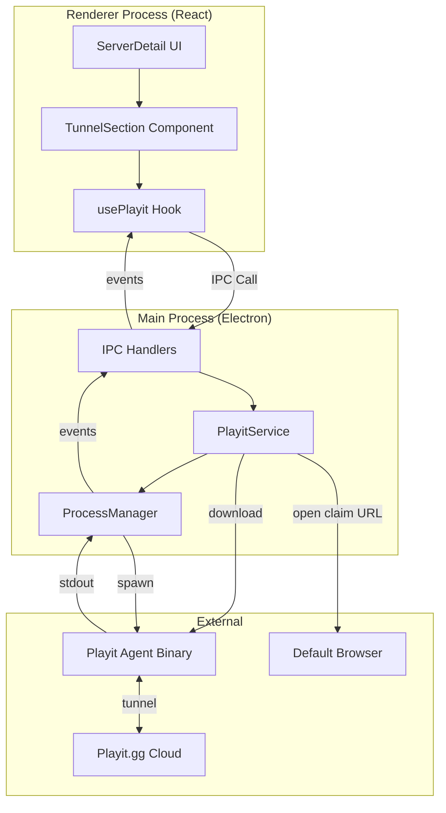

# Design Document: Playit.gg Integration

## Overview

本設計文件描述 Lumix 整合 playit.gg 隧道服務的技術架構與實作細節。此功能讓使用者可以一鍵開啟公開連線，讓朋友無需 port forwarding 即可連線到本地 Minecraft 伺服器。

### 設計目標

1. **易用性**: 一鍵啟用公開連線，無需手動設定
2. **彈性**: 支援訪客模式與註冊帳號兩種使用方式
3. **可靠性**: 穩定的隧道連線與狀態監控
4. **安全性**: 安全儲存 secret key，保護使用者帳號

## Architecture

### 系統架構圖



### 資料流

```mermaid
sequenceDiagram
    participant UI as UI (Renderer)
    participant IPC as IPC Layer
    participant PS as PlayitService
    participant Agent as Playit Agent
    participant Browser as Browser
    participant Cloud as Playit Cloud
    
    Note over UI,Cloud: First Time Setup Flow
    UI->>IPC: playit:start-tunnel(serverId)
    IPC->>PS: startTunnel(serverId)
    PS->>PS: checkAgentInstalled()
    alt Agent not installed
        PS->>PS: downloadAgent()
        PS-->>IPC: download-progress event
    end
    PS->>Agent: spawn (no secret key)
    Agent->>Agent: generate claim code
    Agent-->>PS: stdout: claim URL
    PS-->>IPC: claim-url event
    IPC-->>UI: show auth dialog
    UI->>IPC: playit:open-claim(url, mode)
    IPC->>Browser: open claim URL
    
    Note over UI,Cloud: User completes auth in browser
    Agent<-->>Cloud: receive secret key
    Agent-->>PS: stdout: secret key
    PS->>PS: saveSecretKey()
    Agent-->>PS: stdout: tunnel address
    PS-->>IPC: tunnel-connected event
    IPC-->>UI: show public address
    
    Note over UI,Cloud: Subsequent Start Flow
    UI->>IPC: playit:start-tunnel(serverId)
    IPC->>PS: startTunnel(serverId)
    PS->>Agent: spawn --secret <key>
    Agent<-->Cloud: auto-auth
    Agent-->>PS: stdout: tunnel address
    PS-->>IPC: tunnel-connected event
    IPC-->>UI: show public address
```

## Components and Interfaces

### 1. PlayitService

負責 playit agent 的下載、啟動與隧道管理。

```typescript
interface PlayitService {
  // Agent Management
  isAgentInstalled(): Promise<boolean>;
  downloadAgent(onProgress?: (progress: number) => void): Promise<void>;
  getAgentPath(): string;
  
  // Tunnel Operations
  startTunnel(serverId: string, port: number): Promise<void>;
  stopTunnel(serverId: string): Promise<void>;
  getTunnelStatus(serverId: string): TunnelStatus;
  
  // Authentication
  hasSecretKey(): boolean;
  getSecretKey(): string | null;
  saveSecretKey(key: string): Promise<void>;
  clearSecretKey(): Promise<void>;
  
  // Events
  on(event: 'status-changed', handler: (data: TunnelStatusEvent) => void): void;
  on(event: 'claim-url', handler: (data: ClaimUrlEvent) => void): void;
  on(event: 'download-progress', handler: (progress: number) => void): void;
}
```

### 2. IPC Channels

```typescript
// ipc-channels.ts
export const PlayitChannels = {
  // Commands
  CHECK_INSTALLED: 'playit:check-installed',
  DOWNLOAD_AGENT: 'playit:download-agent',
  START_TUNNEL: 'playit:start-tunnel',
  STOP_TUNNEL: 'playit:stop-tunnel',
  OPEN_CLAIM: 'playit:open-claim',
  GET_STATUS: 'playit:get-status',
  CLEAR_AUTH: 'playit:clear-auth',
  
  // Events
  STATUS_CHANGED: 'playit:status-changed',
  CLAIM_URL: 'playit:claim-url',
  DOWNLOAD_PROGRESS: 'playit:download-progress',
} as const;
```

### 3. IPC Handlers

```typescript
// playit-handlers.ts
export function initPlayitHandlers(playitService: PlayitService): void {
  ipcMain.handle(PlayitChannels.CHECK_INSTALLED, async () => {
    return playitService.isAgentInstalled();
  });
  
  ipcMain.handle(PlayitChannels.DOWNLOAD_AGENT, async () => {
    return playitService.downloadAgent();
  });
  
  ipcMain.handle(PlayitChannels.START_TUNNEL, async (_, serverId: string, port: number) => {
    return playitService.startTunnel(serverId, port);
  });
  
  ipcMain.handle(PlayitChannels.STOP_TUNNEL, async (_, serverId: string) => {
    return playitService.stopTunnel(serverId);
  });
  
  ipcMain.handle(PlayitChannels.OPEN_CLAIM, async (_, url: string) => {
    return shell.openExternal(url);
  });
  
  ipcMain.handle(PlayitChannels.GET_STATUS, async (_, serverId: string) => {
    return playitService.getTunnelStatus(serverId);
  });
  
  ipcMain.handle(PlayitChannels.CLEAR_AUTH, async () => {
    return playitService.clearSecretKey();
  });
  
  // Event forwarding
  playitService.on('status-changed', (event) => {
    BrowserWindow.getAllWindows().forEach((win) => {
      win.webContents.send(PlayitChannels.STATUS_CHANGED, event);
    });
  });
  
  playitService.on('claim-url', (event) => {
    BrowserWindow.getAllWindows().forEach((win) => {
      win.webContents.send(PlayitChannels.CLAIM_URL, event);
    });
  });
  
  playitService.on('download-progress', (progress) => {
    BrowserWindow.getAllWindows().forEach((win) => {
      win.webContents.send(PlayitChannels.DOWNLOAD_PROGRESS, progress);
    });
  });
}
```

### 4. React Hook

```typescript
// use-playit.ts
interface UsePlayitReturn {
  // State
  status: TunnelStatus;
  publicAddress: string | null;
  isDownloading: boolean;
  downloadProgress: number;
  
  // Actions
  startTunnel: (serverId: string, port: number) => Promise<void>;
  stopTunnel: (serverId: string) => Promise<void>;
  openClaimUrl: (url: string) => Promise<void>;
  clearAuth: () => Promise<void>;
  
  // Auth State
  hasAuth: boolean;
  showAuthDialog: boolean;
  claimUrl: string | null;
  setShowAuthDialog: (show: boolean) => void;
}
```

### 5. UI Components

```typescript
// TunnelSection.tsx - 整合到 ServerDetail
interface TunnelSectionProps {
  serverId: string;
  serverPort: number;
  serverStatus: ServerStatus;
}

// AuthModeDialog.tsx - 選擇訪客或註冊
interface AuthModeDialogProps {
  open: boolean;
  onClose: () => void;
  onSelectMode: (mode: 'guest' | 'register') => void;
  claimUrl: string;
}
```

## Data Models

### TunnelStatus

```typescript
type TunnelStatus = 'disconnected' | 'downloading' | 'connecting' | 'authenticating' | 'connected' | 'error';

interface TunnelStatusEvent {
  serverId: string;
  status: TunnelStatus;
  publicAddress?: string;
  error?: string;
}
```

### ClaimUrlEvent

```typescript
interface ClaimUrlEvent {
  serverId: string;
  claimUrl: string;
}
```

### PlayitSettings

```typescript
interface PlayitSettings {
  secretKey?: string;
  authMode?: 'guest' | 'registered';
  lastConnectedAt?: string;
}
```

### Agent Download URLs

```typescript
const PLAYIT_DOWNLOAD_URLS = {
  win32: 'https://github.com/playit-cloud/playit-agent/releases/latest/download/playit-windows-x86_64.exe',
  darwin: 'https://github.com/playit-cloud/playit-agent/releases/latest/download/playit-darwin-x86_64',
  linux: 'https://github.com/playit-cloud/playit-agent/releases/latest/download/playit-linux-x86_64',
} as const;
```

### 檔案系統結構

```
{userData}/
├── playit/
│   └── playit.exe          # Playit agent binary (Windows)
└── settings.json           # Contains playitSettings with secretKey
```

## Correctness Properties

### Property 1: Agent Download Idempotency

*For any* call to `downloadAgent()` when agent is already installed, the operation SHALL skip download and return success.

**Validates: Requirements 1.5**

### Property 2: Download Progress Reporting

*For any* agent download operation, progress events SHALL be emitted with values from 0 to 100.

**Validates: Requirements 1.2**

### Property 3: Auth Mode Choice Presentation

*For any* first-time tunnel start (no secret key), the system SHALL present auth mode choice before opening claim URL.

**Validates: Requirements 2.1**

### Property 4: Claim URL Auto-Open

*For any* claim URL received from agent, the system SHALL automatically open it in the default browser after user selects auth mode.

**Validates: Requirements 2.4**

### Property 5: Secret Key Persistence

*For any* successful authentication, the secret key SHALL be persisted to settings and available after app restart.

**Validates: Requirements 6.1, 6.3**

### Property 6: Auto-Auth with Secret Key

*For any* tunnel start when secret key exists, the agent SHALL be started with the secret key for automatic authentication.

**Validates: Requirements 3.1**

### Property 7: Status Transitions Emit Events

*For any* tunnel status change, a status-changed event SHALL be emitted with the correct server ID and new status.

**Validates: Requirements 5.2**

### Property 8: Public Address Display

*For any* successfully connected tunnel, the public address SHALL be included in the status event.

**Validates: Requirements 3.2, 4.1**

### Property 9: Process Exit Updates Status

*For any* agent process exit (normal or abnormal), the tunnel status SHALL be updated to disconnected.

**Validates: Requirements 3.4**

### Property 10: Cannot Start Tunnel for Stopped Server

*For any* server with status `stopped`, attempting to start tunnel SHALL be rejected.

**Validates: Requirements 8.2**

### Property 11: Error Messages Are Descriptive

*For any* operation that fails, the error SHALL contain a descriptive message.

**Validates: Requirements 7.5**

### Property 12: Logout Clears Secret Key

*For any* logout/disconnect operation, the secret key SHALL be removed from settings.

**Validates: Requirements 6.4**

## Error Handling

### Error Categories

| Category | Error Code | Description | Recovery Action |
|----------|------------|-------------|-----------------|
| Download | `DOWNLOAD_FAILED` | Failed to download agent | Show retry button |
| Download | `NETWORK_ERROR` | Network unavailable | Show network error message |
| Auth | `AUTH_TIMEOUT` | Claim not completed in time | Allow retry |
| Auth | `INVALID_SECRET` | Secret key rejected | Clear key, re-authenticate |
| Process | `SPAWN_FAILED` | Failed to start agent | Show error, allow retry |
| Process | `AGENT_CRASHED` | Agent exited unexpectedly | Update status, allow restart |
| Tunnel | `PORT_IN_USE` | Local port conflict | Show port conflict error |
| State | `SERVER_NOT_RUNNING` | Server must be running | Disable tunnel controls |

### Error Response Format

```typescript
interface PlayitError {
  code: string;
  message: string;
  details?: Record<string, unknown>;
}

interface PlayitResult<T> {
  success: boolean;
  data?: T;
  error?: PlayitError;
}
```

## Testing Strategy

### Unit Tests

```typescript
describe('PlayitService', () => {
  describe('isAgentInstalled', () => {
    it('should return false when agent not downloaded', async () => {
      const result = await playitService.isAgentInstalled();
      expect(result).toBe(false);
    });
    
    it('should return true when agent exists', async () => {
      // Setup: create mock agent file
      const result = await playitService.isAgentInstalled();
      expect(result).toBe(true);
    });
  });
  
  describe('startTunnel', () => {
    it('should start agent with secret key when available', async () => {
      playitService.saveSecretKey('test-secret');
      await playitService.startTunnel('server-1', 25565);
      // Verify agent started with --secret flag
    });
    
    it('should emit claim-url event when no secret key', async () => {
      const claimHandler = vi.fn();
      playitService.on('claim-url', claimHandler);
      await playitService.startTunnel('server-1', 25565);
      expect(claimHandler).toHaveBeenCalled();
    });
  });
});
```

### Integration Tests

```typescript
describe('Playit Integration', () => {
  it('should complete full tunnel setup flow', async () => {
    // 1. Start tunnel (no auth)
    // 2. Receive claim URL
    // 3. Simulate auth completion
    // 4. Verify tunnel connected
    // 5. Verify public address displayed
  });
});
```

## Implementation Notes

### Agent Output Parsing

Playit agent 輸出格式範例：

```
# 首次啟動 (無 secret key)
Visit the following URL to claim this agent:
https://playit.gg/claim/abc123

# 認證成功後
Secret key: sk_xxxxxxxxxxxxxxxx
Tunnel established: abc123.gl.ply.gg:25565

# 使用 secret key 啟動
Tunnel established: abc123.gl.ply.gg:25565
```

### Platform-Specific Considerations

- **Windows**: Agent 為 `.exe` 檔案，需設定執行權限
- **macOS/Linux**: 需要 `chmod +x` 設定執行權限
- **Firewall**: 可能需要提示使用者允許網路存取

### Security Considerations

- Secret key 應儲存在使用者資料目錄，不應提交到版本控制
- 不應在日誌中輸出完整的 secret key
- 使用 HTTPS 下載 agent binary
