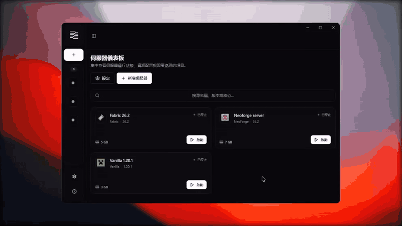

<p align="center">
  <a href="README.md">繁體中文</a> · <a href="README.en.md">English</a>
</p>

<p align="center">
  
</p>

<h1 align="center">Lumix</h1>

<p align="center">
  <strong>把 Minecraft 伺服器管理，從批次檔與資料夾帶進一個乾淨的桌面工作區。</strong>
</p>

<p align="center">
  在 Windows 上建立、匯入、啟停與備份 Minecraft 伺服器；集中處理 Java、模組包、即時 Console 與連線診斷。
</p>

<p align="center">
  <a href="https://github.com/0png/Lumix/releases/latest"></a>
  <a href="https://github.com/0png/Lumix/releases"></a>
  <a href="LICENSE"></a>
  
</p>

<p align="center">
  <a href="https://github.com/0png/Lumix/releases/latest"></a>
</p>

<p align="center">
  <a href="https://github.com/0png/Lumix/releases/latest">最新版本</a> ·
  <a href="CHANGELOG.md">更新紀錄</a> ·
  <a href="https://github.com/0png/Lumix/issues">回報問題</a>
</p>



<p align="center"><sub>30 秒看完伺服器建立、記憶體設定與即時 Console 流程</sub></p>

## 為什麼選擇 Lumix？

Lumix 是一款 Windows-first、開放原始碼的 Minecraft Server Launcher。它不取代 Minecraft 伺服器，而是把平常散落在 JAR、啟動腳本、Java 路徑與設定檔裡的工作整理成一套可視化流程。

| | |
|---|---|
| **更快開始** | 選擇 Minecraft 版本與核心，Lumix 會下載所需檔案並協助匹配 Java。 |
| **一個工作區** | 建立、匯入、啟停、Console、玩家、設定與檔案入口集中在同一個桌面 App。 |
| **支援模組生態** | 支援 Fabric、Forge、NeoForge，以及 Modrinth／CurseForge 伺服器模組包匯入。 |
| **操作更安心** | 提供排程備份、還原前檢查與保護性備份，並協助判讀本機、區網與外網連線。 |

## 主要功能

- **多核心建立** — Vanilla、Paper、Purpur、Fabric、Forge、NeoForge
- **既有伺服器匯入** — 將已存在的伺服器資料夾納入 Lumix 管理
- **模組包匯入** — 讀取 Modrinth 與 CurseForge 格式並完成伺服器端安裝
- **Java 管理** — 偵測本機 Java，依 Minecraft 版本選擇相容執行環境
- **即時 Console** — 查看伺服器輸出、傳送指令與快速清除畫面
- **圖形化設定** — 編輯記憶體與常用 `server.properties` 選項
- **備份與還原** — 手動／排程備份、還原前 preflight 與 pre-restore backup
- **連線診斷** — 顯示 localhost、LAN 位址、連接埠與外網連線建議
- **桌面體驗** — 繁體中文／English、亮色／暗色／跟隨系統與自動更新

## 下載與安裝

1. 前往 [Latest Release](https://github.com/0png/Lumix/releases/latest)。
2. 下載 `Lumix-Setup-<version>.exe`。
3. 執行安裝程式，開啟 Lumix 後建立或匯入第一個伺服器。

### 系統需求

| 項目 | 需求 |
|---|---|
| 作業系統 | Windows 10 / 11（x64） |
| 記憶體 | 建議至少 4 GB；實際需求取決於伺服器與模組包 |
| 儲存空間 | Lumix 約需 500 MB，伺服器、Java、世界與備份需額外空間 |
| 網路 | 下載核心、Java、模組包、版本資料與更新時需要 |

> [!NOTE]
> Lumix 目前尚未提供程式碼簽章，Windows SmartScreen 可能顯示保護提示。請只從本 repo 的 [GitHub Releases](https://github.com/0png/Lumix/releases) 下載，並可在 Release 資產資訊中核對 SHA-256 digest。

## 三種開始方式

### 建立標準伺服器

選擇 Minecraft 版本、核心與記憶體配置，Lumix 會準備伺服器檔案並建立可直接管理的實例。

### 匯入模組包

選擇 Modrinth 或 CurseForge 模組包；Lumix 會掃描 loader、Minecraft 版本與伺服器端檔案，再顯示匯入摘要。

### 匯入既有伺服器

指定現有伺服器資料夾，保留原本的世界與設定，並將啟停、Console、備份和設定納入 Lumix。

## 支援的核心

| 核心 | 適合情境 |
|---|---|
| Vanilla | 官方原版體驗 |
| Paper | 注重效能與插件生態 |
| Purpur | 建立在 Paper 生態上的進階自訂 |
| Fabric | 輕量、更新快速的模組載入器 |
| Forge | 成熟且廣泛使用的模組平台 |
| NeoForge | 現代 Minecraft 版本的模組平台 |

## 本機資料與網路

伺服器世界、設定與備份保留在你的 Windows 電腦。Lumix 只會在下載伺服器核心、Java、模組包、玩家頭像、版本資料或應用程式更新時連線至對應服務。

Lumix 能顯示區網位址並提供外網連線檢查方向，但不會自動修改路由器、防火牆或建立代管服務。

## 從原始碼執行

需要 Node.js 20+ 與 pnpm 8+。

```bash
git clone https://github.com/0png/Lumix.git
cd Lumix
pnpm install
pnpm --filter @lumix/app dev
```

常用驗證與建置：

```bash
pnpm --filter @lumix/app typecheck
pnpm --filter @lumix/app lint
pnpm --filter @lumix/app test
pnpm --filter @lumix/app build
pnpm --filter @lumix/app build:win
```

技術棧：Electron、Vite、React、TypeScript、Tailwind CSS、Radix UI。

## 參與專案

- 遇到問題：先搜尋或建立 [Issue](https://github.com/0png/Lumix/issues)
- 有改善想法：歡迎提出 Issue 或 Pull Request
- 提交程式碼前：請至少執行受影響範圍的 typecheck、lint 與 test

## 致謝

- [Crafthead](https://crafthead.net/) — Minecraft 玩家頭像渲染
- [OpenScreen](https://github.com/siddharthvaddem/openscreen) — 用於錄製與製作 Lumix 操作示範
- Paper、Purpur、Fabric、Forge、NeoForge 與 Minecraft 開源社群

## 授權與聲明

Lumix 採用 [MIT License](LICENSE)。

Lumix 是獨立開源專案，並非 Minecraft、Mojang Studios 或 Microsoft 的官方產品，也未獲其認可或隸屬於上述組織。

<p align="center">
  Made by <a href="https://github.com/0png">0png</a>
</p>
